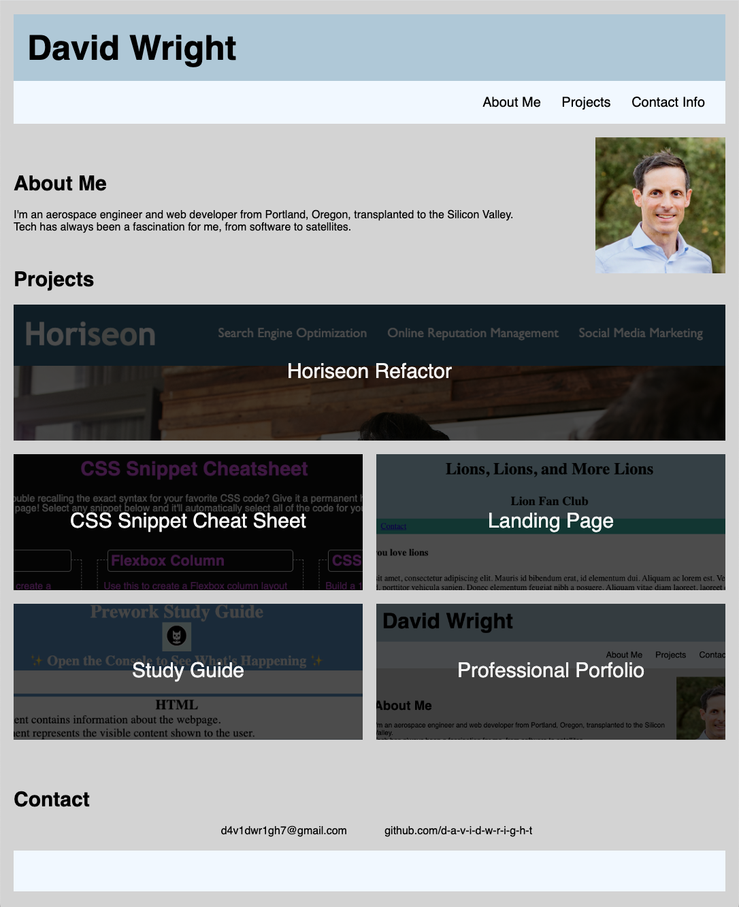
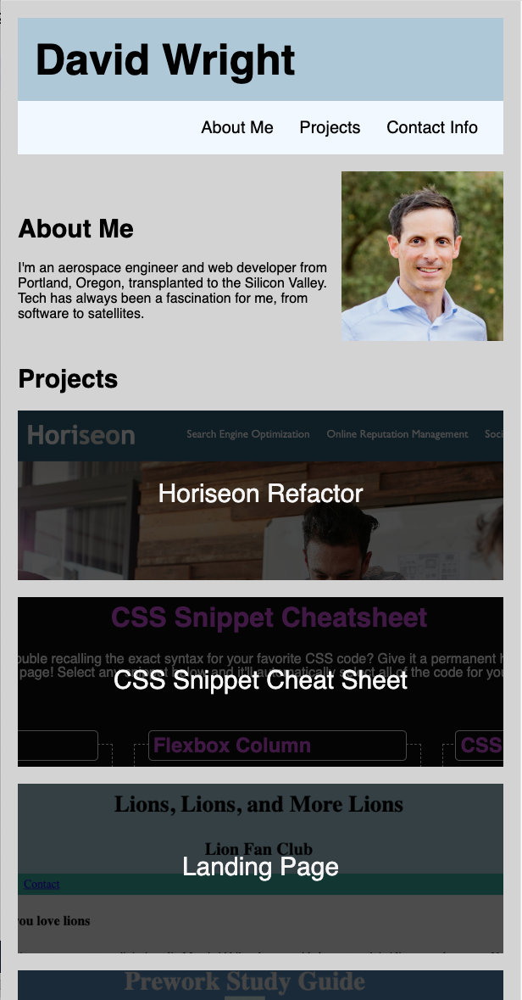
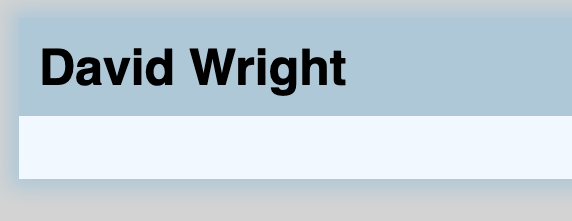
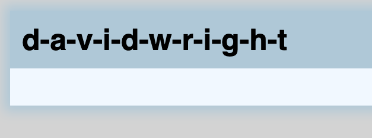

# Professional Portfolio

## Description 

For this project, I was tasked to create a professional portfolio to highlight personal information, links to various deployed projects, and contact information. I researched portfolio pages and found that experienced designers make them quite involved and impressive.

In this project I learned more about CSS class and ID selectors, as well as how to utilize the grid layout. I also had fun with some interactive features such as alt text and box shadow effects on hover. I finally included a media query to alter the grid layout depending on browser window width to make my page more responsive and accessible to multiple screen sizes.

I deployed the application on [GitHub](https://github.com/) [Pages](https://pages.github.com/), and it can be found [here](https://d-a-v-i-d-w-r-i-g-h-t.github.io/professional-portfolio/).

## Installation

N/A

## Usage 

Screenshot of the web page are provided below showing both the wide and narrow formats.

Navigation links are at the top right and jump the user to the designated content sections using anchor tags. As the web page isn't very long, this functionality is easier to demonstrate if the user's browser window height is reduced.

The page formatting changes between two columns and one column as shown above when the width is adjusted.

Alternate text and hover glow effects appear when the user hovers over titles or project images, as shown below:

## Credits

I learned about grid layout from [CSS Tricks](https://css-tricks.com/), [A Complete Guide to CSS Grid](https://css-tricks.com/snippets/css/complete-guide-grid/).

I learned about hover glow from our CSS Code Snippet project.

I used the Horiseon Refactor project to format my unnumbered lists.

The template for this README file was provided by [edX Boot Camps](https://www.edx.org/boot-camps).

## License

MIT License

Copyright (c) 2023 David Wright

Permission is hereby granted, free of charge, to any person obtaining a copy of this software and associated documentation files (the "Software"), to deal in the Software without restriction, including without limitation the rights to use, copy, modify, merge, publish, distribute, sublicense, and/or sell copies of the Software, and to permit persons to whom the Software is furnished to do so, subject to the following conditions:

The above copyright notice and this permission notice shall be included in all copies or substantial portions of the Software.

THE SOFTWARE IS PROVIDED "AS IS", WITHOUT WARRANTY OF ANY KIND, EXPRESS OR IMPLIED, INCLUDING BUT NOT LIMITED TO THE WARRANTIES OF MERCHANTABILITY, FITNESS FOR A PARTICULAR PURPOSE AND NONINFRINGEMENT. IN NO EVENT SHALL THE AUTHORS OR COPYRIGHT HOLDERS BE LIABLE FOR ANY CLAIM, DAMAGES OR OTHER LIABILITY, WHETHER IN AN ACTION OF CONTRACT, TORT OR OTHERWISE, ARISING FROM, OUT OF OR IN CONNECTION WITH THE SOFTWARE OR THE USE OR OTHER DEALINGS IN THE SOFTWARE.
